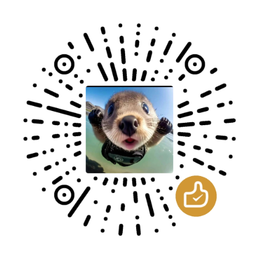

<h1 align="center">
   
  
   
  纯粹直播（Pure Live）
   
</h1>

<h4 align="center">一款开源的第三方多平台直播聚合播放器</h4>
<h4 align="center">A Third-party Live Stream Aggregator Built with Flutter</h4>

  
  
  
  

> ⚠️ **本软件仅用于个人学习与技术交流，请勿用于商业用途。下载后请于 24 小时内删除。**

> 本仓库是 [liuchuancong/pure_live](https://github.com/liuchuancong/pure_live) 的功能维护分支，增加了可配置的小窗弹幕，并提供独立构建与发布。最新安装包见 [Releases](https://github.com/wzgrx/pure_live/releases/latest)。

---

## 📺 支持平台
<h1 align="center">
  
</h1>

- 哔哩哔哩（Bilibili）  
- 虎牙直播（Huya）  
- 斗鱼直播（Douyu）  
- 快手（Kuaishou）  
- 抖音（Douyin）  
- 网易 CC 直播  
- 自定义 M3U8 源（支持本地/网络导入）

支持按分区筛选、隐藏不关注平台，节省流量与内存。

---

## ✨ 核心功能

- ✅ **多端支持**：Android / Android TV / Windows / macOS （iOS 待合作者支持）  
- ✅ **多播放器切换**：内置 IJKPlayer / EXOPlayer / MPV Player（Android/TV）  
- ✅ **直播录制**：支持直播流实时录制，保存本地随时回放  
- ✅ **自定义直播源**：通过 M3U/M3U8 导入网络或本地直播流  
- ✅ **数据同步与备份**：支持 WebDAV 同步、本地导出/导入配置  
- ✅ **弹幕增强**：支持弹幕过滤、合并、描边、FPS 与显示优化
- ✅ **小窗弹幕**：Android 系统画中画、Windows 小窗和应用内悬浮窗均可显示弹幕
- ✅ **定时关闭**：可设置倒计时自动退出应用  
- ✅ **用户系统（可选）**：基于 [Firebase](https://console.firebase.google.com/) 实现注册/登录（需科学上网）

> 💡 提示：如需使用 Firebase 功能，可自行 Fork 项目并在 Firebase 控制台部署服务。

---

## 🔒 声明与合规

- 本项目为 **非盈利性开源软件**，遵循 **[GPL-3.0 协议](LICENSE)**。  
- **不提供任何 VIP 解锁、视频破解或盗链服务**。高清直播需您在对应平台拥有合法账号权限。  
- 所有直播内容（视频、音频、图像等）**版权归属原平台所有**，本软件仅作技术聚合与转码展示。  
- 若您认为本项目侵犯您的合法权益，请通过 [GitHub Issue](https://github.com/wzgrx/pure_live/issues) 联系我们，我们将及时处理。

---

## 🛡️ 隐私策略

- 项目未集成广告或行为追踪 SDK；直播请求主要发往对应平台，登录、版本更新和用户主动配置的同步功能会访问 Firebase、GitHub 或 WebDAV。
- 用户 Cookie 用于对应平台的身份认证。自备份格式 v3 起，本地导出、Firebase、WebDAV 和 TV 同步默认排除 Cookie 与 WebDAV 凭据；旧版备份可能含有这些字段，请妥善保管。
- Android 在后台音频播放时会启用媒体播放前台服务，并显示系统通知；关闭播放后释放相关资源。
- Android 已关闭系统级应用数据备份，避免系统云备份复制本地会话数据。

---

## 🛠 使用说明

### ▶️ 播放器选择
- **Android/TV**：可在设置中切换 IJKPlayer / EXOPlayer / MPV Player。
- **字幕支持**：
  - Android：使用系统自带实时字幕功能
  - Windows：启用 Windows 11 的 *Live Captions*（任务栏搜索即可）

### 🔑 Bilibili 高清直播
因平台限制，观看高清直播需登录。  
您可通过应用内“三方认证”获取 Cookie。Cookie 用于对应平台请求，并默认从所有同步和导出备份中剔除。

### 💬 小窗弹幕

进入直播间的弹幕设置后，可单独配置“小窗弹幕”：

- 适用模式：Android 系统画中画、Windows 小窗、应用内悬浮窗。
- 显示样式：保留平台原始颜色，或选择自定义颜色、字号与透明度。
- 运动效果：速度、显示区域、最大数量、发送间隔与刷新 FPS。
- 小窗适配：可开启自动缩放；小窗使用独立弹幕控制器，不影响主播放器弹幕队列。

设置会保存到本地，重新进入直播间和再次开启小窗时继续生效。

### 📥 导入 M3U 源
1. 打开 App → 设置 → 备份与还原 → 导入 M3U 源  
2. 支持从 [123云盘](https://www.123pan.com/s/Jucxjv-NwYYd.html) 下载示例源  
3. 源转换工具推荐：[直播源转换器](https://kukuqi666.github.io/Tvbox-decrypt)

> 📂 存储位置：
> - **Android**：清除缓存即可移除导入内容  
> - **Windows**：配置文件位于  
>   `安装目录\AppData\*`

### 📦 下载与构建

- 最新稳定构建：[GitHub Releases](https://github.com/wzgrx/pure_live/releases/latest)
- Android：按设备架构选择 `arm64-v8a`、`armeabi-v7a` 或 `x86_64` APK。
- Windows：下载 `PureLive-*-windows-x64-setup.exe` 安装，或使用 `PureLive-*-windows-x64-portable.zip` 便携包。
- 完整性校验：每个 Release 附带 `SHA256SUMS.txt`。
- 本仓库优先使用本机构建以节省 Actions 配额；开发、测试和本地发布流程见 [run.MD](run.MD)。

> 正式 Android Release 必须使用仓库专用签名。本地未配置正式密钥时，脚本生成包名为 `com.mystyle.purelive.qa` 的调试签名 QA 包，可与已安装的正式版并存；QA 包不会被本地发布脚本误传到正式 Release。

---

## ❓ 常见问题

| 问题 | 解决方案 |
|------|--------|
| 关闭软件时弹出“快速异常检测失败” | Windows 特定提示，**不影响使用**，可忽略 |
| Windows 恢复手机备份后无画面、仅有弹幕 | 进入 **设置 → 播放器**，重新选择或重置播放器 |
| 部分设备无法播放（黑屏/卡顿） | 尝试切换播放器（IJK ↔ MPV ↔ EXO），或检查硬件解码支持 |

> ⚠️ **华为设备兼容性**：因系统框架限制，部分华为机型可能存在卡顿，暂无优化方案，敬请谅解。

---

## 🤝 参与开发

- **上游主开发者**：[@liuchuancong](https://github.com/liuchuancong)
- **协助开发者**：[@RebornQ](https://github.com/RebornQ)
- **小窗弹幕维护分支**：[@wzgrx](https://github.com/wzgrx)

> 📌 **欢迎贡献**！  
> - 如发现 License 使用不当，请提交 Issue 或 Pull Request  
> - 如有 macOS/iOS 打包能力，欢迎联系合作！

### 代码参考
- [dart_simple_live](https://github.com/xiaoyaocz/dart_simple_live)  
- [pure_live (Jackiu1997)](https://github.com/Jackiu1997/pure_live)

---

## 🌟 Star 趋势

---

## ☕ 捐助支持

如果您觉得本项目对您有帮助，欢迎扫码支持开发者一杯咖啡 ☕

  

> 您的支持是我持续维护的动力！感谢 ❤️
